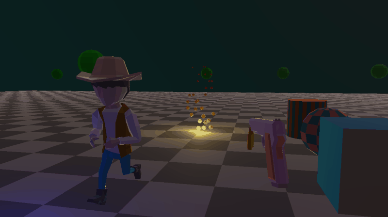
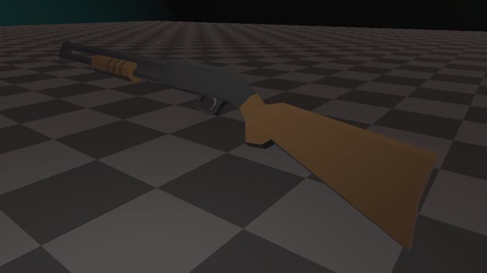
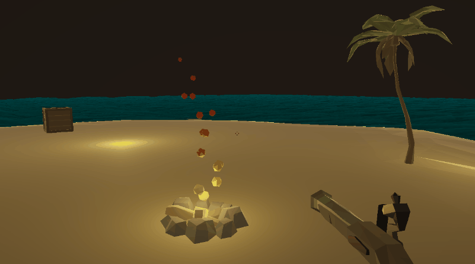

# War Game
simple war game i made for practice

### Animations
a library of poses is used in combination with various interpolation techniques to add impact and fidelity.

### Particle System
simple but versatile particle system that is capable of basic effects
like fire, explosions, blood spurts, etc. supports wind & physics as well.

### Physics
coming soonish

### Credits
- art : some assets were purchased from the very talanted artists at [Synty Studios](https://syntystore.com/collections/frontpage)
