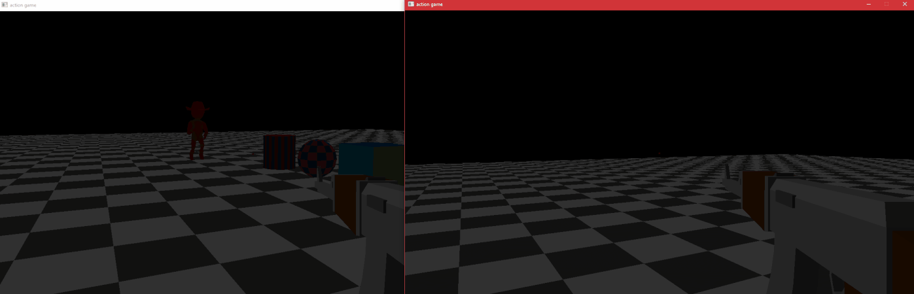

# Journal
This repository was originally meant to be a safe space where i could
practice making games that didn't involve chunks(like my voxel game),
because being forced to design systems that need to support chunks
is hard, and the extra inertia whenever i tried to impement a new idea
was very frustrating.

"action game" was the original name for this repo, bceause my original vision for
this project was that it was going to be some kind of first person action game like DOOM.

## FFT Water Problem
At some point i decided that 3 gerstner waves added to each other didn't look good enough.
so i did some research on fft water and ended up with a workable but not fully working implementation.

## archive
This is what action-game's README looked like right before it became pirate-game

## action-game

i'm not sure what this repo will end up being.
for now, it's just a place where i have fun programming

### Animations
instead of traditional animation, a library of poses is used
with different interpolation techniques to add impact and fidelity.

### Particle System
simple but versitile particle system that is capable of basic effects
like fire, explosions, blood spurts, etc. it supports wind and physics as well.

### Multiplayer
nothing special here, just a basic multiplayer implementation 
that sends position & orientation data over tcp every few miliseconds.

### Credits & Extras
- programmer : Me
- art : some assets were purchased form the incredibly talanted folks at syntystudios

### extra stuff
void save_fft2D(Complex* data, uint N, const char* name = "fft2D.bmp")
{
	bvec3* bitmap = (bvec3*)calloc(N * N, 3); // 3 bytes per channel
	for (int i = 0; i < N; i++) { // up & down
	for (int j = 0; j < N; j++)	// left & right
	{
		Complex z = data[(i * N) + j];
		byte r = (cos(arg(z)) * 127) + 128;
		byte g = (cos(arg(z)) * 127) + 128;
		byte b = (cos(arg(z)) * 127) + 128;
		bitmap[(i * N) + j] = { r , g , b };
	} }

	stbi_write_bmp(name, N, N, 3, (byte*)bitmap);
	free(bitmap);
}
void save_ifft2D(Complex* data, uint N, const char* name = "ifft2D.bmp")
{
	bvec3* bitmap = (bvec3*)calloc(N * N, 3); // 3 bytes per channel
	for (int i = 0; i < N; i++) { // up & down
	for (int j = 0; j < N; j++)	// left & right
	{
		Complex z = data[(i * N) + j];

		byte r = (abs(z) * cos(arg(z)) * 127) + 128;
		byte g = (abs(z) * cos(arg(z)) * 127) + 128;
		byte b = (abs(z) * cos(arg(z)) * 127) + 128;
		bitmap[(i * N) + j] = { r , g , b };
	} }

	stbi_write_bmp(name, N, N, 3, (byte*)bitmap);
	free(bitmap);
}

void fft_demo()
{
	{ // forward dft
		Complex input[8];
		input[0] = Complex(1);
		input[1] = Complex(.707106);
		input[2] = Complex(0);
		input[3] = Complex(-.707106);
		input[4] = Complex(-1);
		input[5] = Complex(-.707106);
		input[6] = Complex(0);
		input[7] = Complex(.707106);

		uint N = 8;     // sample count (always power of 2)
		uint H = N / 2; // always an integer because n is power of 2

		fft(input, N);
		Complex* output = input; // since the data has been transformed

		for (uint i = 0; i < N; i++) out(i << ": " << output[i]);

		out("\n after scaling:");
		for (uint i = 0; i < N; i++) output[i] /= H;
		for (uint i = 0; i < N; i++) out(i << ": " << output[i]);

		out("\n magnitudes:");
		for (uint i = 0; i < N; i++) out(i << ": " << abs(output[i]));

		out("\n result:");
		for (uint i = 0; i < N; i++) print(" %.2fcos(%dx + %.2f)\n", abs(output[i]), i, arg(output[i]));
	}
	out(' ');
	{ // inverse dft
		uint N = 4;
		Complex input[4];
		input[0] = Complex(N * 0); // N * (magnitude, phase)
		input[1] = Complex(N * 1); // N * (magnitude, phase)
		input[2] = Complex(N * 0); // N * (magnitude, phase)
		input[3] = Complex(N * 0); // N * (magnitude, phase)
		ifft(input, N);
		for (uint i = 0; i < N; i++) out(i << ": " << input[i]);
	}

	// --------------
	// note : S = sampling frequency = N/L or N/T (subnote : N/T = Hertz)
	// note : frequency resolution = S/N
	// note : nyquist limit = S/2 = Hertz
	// --------------
	// FORWARD DFT:
	// --------------
	// take N samples on some length L (meters) or time period T (in seconds)
	// perform DFT : result is N complex coefficients
	// compute nyquist limit : S/2 & disgard coefficients above the limit
	// divide remaining coefficients by N/2
	// calculate array a : coefficient magnitudes
	// calculate array b : coefficient phase angles
	// result is sum of a[n]cos(x + b[n])
	// --------------
	// INVERSE DFT:
	// --------------
	// make array a : coefficient magnitudes
	// make array b : coefficient phase angles
	// make array of complex numbers a[n] + ib[n]
	// perform IDFT : result is N samples that are S apart?

	// sine wave sampled at 8 points, if you wanna try it
	//input[0] = Complex(0);
	//input[1] = Complex(.707106);
	//input[2] = Complex(1);
	//input[3] = Complex(.707106);
	//input[4] = Complex(0);
	//input[5] = Complex(-.707106);
	//input[6] = Complex(-1);
	//input[7] = Complex(-.707106);
}
void fft2D_demo()
{
	uint N = 256;
	Complex* a = Alloc(Complex, N * N);
	a[4] = Complex(N * N);
	//a[N] = Complex(N * N);
	ifft2D(a, N);
	save_fft2D(a, N, "demo.bmp");
}

void save_vec3(vec3* data, uint w, uint h, const char* name = "vec3.bmp")
{
	bvec3* bitmap = (bvec3*)calloc(w * h, 3); // 3 bytes per channel
	for (int i = 0; i < w; i++) { // up & down
	for (int j = 0; j < h; j++)	// left & right
	{
		vec3 v = data[(i * w) + j];
		byte r = (v.x * 127) + 128;
		byte g = (v.y * 127) + 128;
		byte b = (v.z * 127) + 128;
		bitmap[(i * w) + j] = { r , g , b };
	} }

	stbi_write_bmp(name, w, h, 3, (byte*)bitmap);
	free(bitmap);
}