### 🧱 source file structure

```mermaid
graph LR

style i fill:#311,stroke:#333,stroke-width:4px

external --> i{intermediary}
proprietary --> i{intermediary}

window(window.h)

i{intermediary}-->window
window-->renderer
renderer-->physics
physics-->terrain
terrain-->particles-->props
props-->player-->weps-->enemies
enemies-->main
```

### 🛠 update notes
+ updated the game

### 🗺 future work
+ finish the game
+ improve lighting system
  + add shadows
  + add dynamic lights
+ destructibles
  + props
  + buildings
+ physics
  + mesh / convex colliders
  + refactor physics
  + how should collider meshes be colored?

### 🐞 bugs & issues
- lighting shader(s) need revision

### 🎮 main.cpp
- init window, input, game systems, and timer
- main game loop
  - update window & input
  - handle key input
  - update game state
  - update renderer
  - render scene
  - update frame timer & restart loop
- shutdown window & exit

### 😡 enemies.h
green spheres that turn more red as they take damage and explode when destroyed

### 🔫 weps.h

Bullet : sphere that moves every frame until it hits something
Gun_Meta : struct containing information about each gun(rifle reload sound, pistol mag size, etc.)
Gun : instance of a gun, stores it's type and ammo count

#### Weapon Animation (WIP)
Goal is high-quality animation with as few keyframes as possible. Juice comes from cleverly
interpolating between each frame. If done right, this has the potential to allow for complex
player-wep interaction and animation variety.

- ease_in_x : these easing functions are mostly used to interpolate between animation keyframes
- sub_anim() : takes a vec4 containing the time to transition between each sub-keyframe
as well as the current time of the animation and returns a uint representing which sub-frame
we are on and stores the mix value (0-1) for interpolating between this sub-keyframe and the next

in general, weapon animations are grouped by wep type (smg, rifle, bolt action, etc),but depending
on the wep there may be custom animations

### 🧙 player.h
player is just a camera glued to a physics capsule

### 🛢 props.h
handles static prop behavior & rendering

- crates : wooden, break into planks
- tanktraps : metal barrier
- sandbag : sand barrier
- campfire : emits light, breaks into stones & sticks, interactable place to cook fish
- tree : cover, can be chopped down
- barrel : explosive

### 💥 particles.h
a particle is defined as...

### ⛰ terrain.h

- HEIGHTMAP_N : terrain resolution; how many data points define the terrain(no effect on in game size)
- HEIGHTMAP_L : length of a side of the (square) terrain in game in meters
- HEIGHTMAP_S : vertical scale of the terrain; y position highest point (terrain data file is normalized 0-1)

defines the structure that stores all the heightmap data for the game map as well as some functions
for manipulating it like explode()

also loads heightmaps from .R32 files

### 🧲 physics.h
- colliders : cube, cone, sphere, capsule, cylinder, heightmap

### 🎨 renderer.h
+ TODO : try to at least document the animation stuff

### ⚙️ window.h
Handles opening a window, setting up OpenGL & OpenAL, and handling keyboard/mouse input

### ⚙️ boilerplate.h
contains all external libraries & includes + mathematics.h, contains macros for printing to
console & allocating memory; contains code for file reading, timers, multithreading, and playing audio

#### preprocessor directives
- out : currently a wrapper for cout
- stop : pauses the program
- print : printf without the f
- printvec : print any vector with xyz components
- Alloc : allocate memory (release with free() from std library)

#### file handling
- read_text_file_into_memory : reads an entire text file into a buffer
- load_file_r32 : reads a .r32 file and rotates the array so it is oriented correctly `(why does this happen?)`

#### timers
- get_timestamp : generate a timestamp at the current time
- calculate_elapsed : calculate the time elapsed between 2 timestamps
- os_sleep : put the thread to sleep for x milliseconds

#### audio
- load_audio : loads audio from a .audio file
- play_audio : plays audio

#### external libraries
- Bullet : 3d physics, modified by me to not need libraries; i.e. you just need to #include it
- GLFW : for opening a window, handling input
- GLEW : OpenGL extension wrangler, don't remember what it does but it does do something
- GLM : math, i hope to replace with something proprietary and smaller at some point
- OpenAL : for audio
- stb_image : for loading images from disk
- stb_image_write : for writing images to disk

### 🧰 extras

#### what file types does the game use?
- meshes : `.mesh`, `.mesh_uv`, `.mesh_anim`, `.mesh_anim_uv`
- animation : `.anim`
- audio : `.audio`
- textures : `.bmp`, `.png(bit depth = 32)`
- heightmap : `.r32`

#### how to i generate these files?
- `png`, `bmp` : whatever you like, just make sure they are formatted correctly
- `r32` : generated with krita (1024 x 1024)
- `mesh`,`anim`, and `audio`: generated by [game-file-converter](https://github.com/Moomed-Hamed/game-file-converter)

#### how do i create an animation?
This is very much a WIP, something has to be done about the state of animation exporting!

- only 1 armature/mesh per file
- delete the collection
- name your armature "Armature"
- name your ArmatureAction "actions"
- name your Material "material"
- no numbers or spaces in names
- make sure number of keyframes in timeline matches number of keyframes in your animation
- keyframe every bone, every frame
- i dont really know how the file converter code works so maybe if your
bone heirarchy is really complex it breaks idk

when exporting
- y up & z forward
- only selected uv map = true

- TODO : write a plugin or make an animator, this is unusable!!!